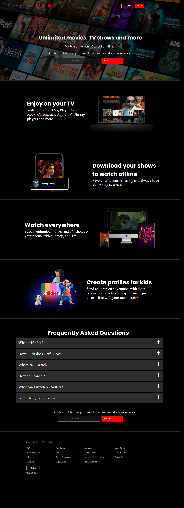

<h1>Netflix Clone</h1>
<h1> Introduction</h1>
Welcome to my Netflix clone website! This project is a front-end clone of the popular streaming service website, Netflix.com. It is built using HTML and CSS and is hosted on GitHub.

<h1> Demo</h1>

<h1> Installation Steps</h1>
    Clone the repository
    <pre>
  https://github.com/DevloperPratikjadhav/Netflix-clone
    </pre>

   Navigate to the project directory 
    <pre>
    cd netflix-clone
    </pre>

   Open index.html in your browser to view the website 
    <pre>
    open index.html
    </pre>

<h1> Contact Info</h1>
For any questions or suggestions, please contact me at:

Email: pratikjadhav6632@gmail.com  
GitHub: https://github.com/DevloperPratikjadhav/Netflix-clone

 
